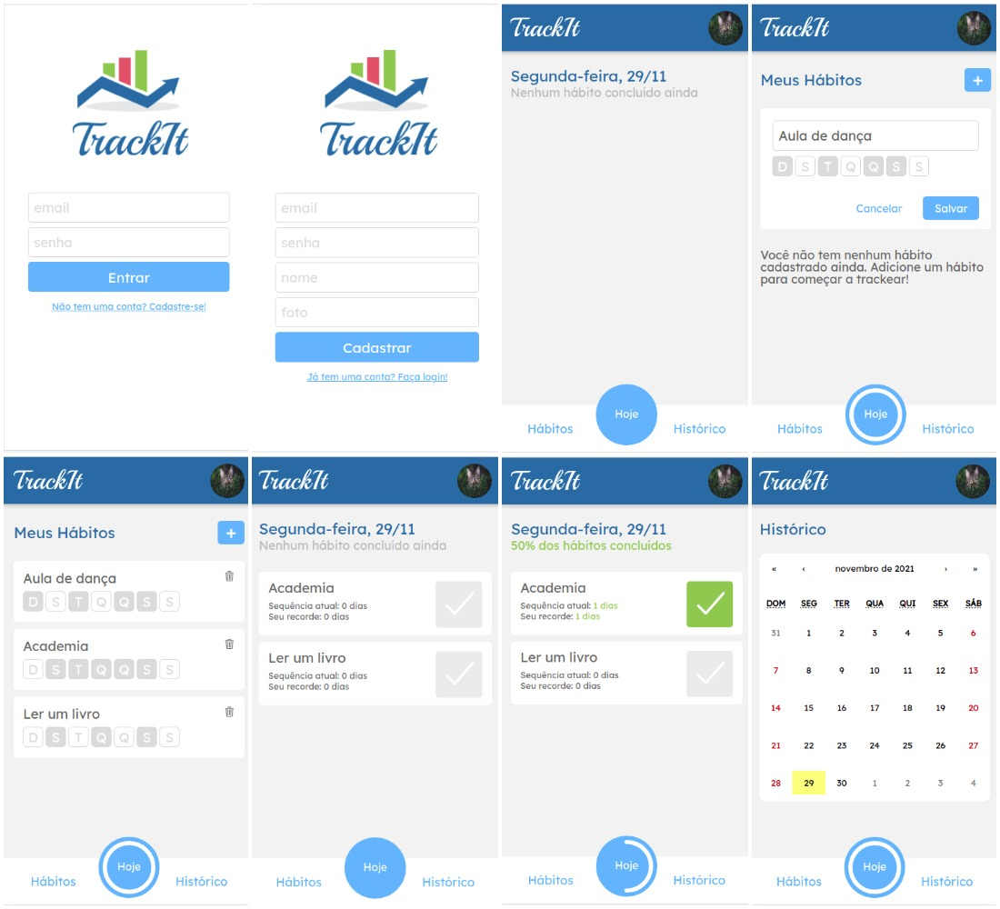

# TrackIt

An easy way to track your habits.



Try it out now at http://projeto10-track-it-five.vercel.app/

## About

This is an web application with which lots of people can manage their own habits checking their progress. Below are the implemented features:

- Sign Up
- Login
- Check/Uncheck today habits
- Create habits for the week
- Check habits progress history

## Technologies

The following tools and frameworks were used in the construction of the project:<br>

<p>
  
  
  

## How to run

1. Clone this repository
2. Install dependencies

```bash
npm i
```

3. Run the app

```bash
npm start
```

4. You can optionally build the project running

```bash
npm run build
```

5. Finally access http://localhost:3000 on your favorite browser
